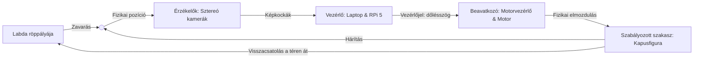

# 1. Bevezetés és Rendszerkoncepció
## 1.1. Előszó és motiváció

Napjaink ipari és technológiai forradalmát a kiber-fizikai rendszerek (Cyber-Physical Systems – CPS), az autonóm járművek és az intelligens automatizálás határozzák meg. Ezen rendszerek közös jellemzője, hogy a digitális világ számítási kapacitását, az algoritmusok intelligenciáját közvetlenül össze kell kapcsolniuk a fizikai valósággal. A szenzorok által gyűjtött adatok valós idejű feldolgozása, a környezetből érkező visszacsatolások értelmezése, majd az erre adott fizikai válasz (aktuáció) zárt szabályozási kört alkot. Ebben a zárt körben az egyik legnagyobb mérnöki kihívást az időtényező, vagyis a rendszerszintű késleltetés (latency) minimalizálása jelenti. 

A számítógépes látás (Computer Vision) az elmúlt évtizedben hatalmas fejlődésen ment keresztül, köszönhetően a mély tanulási modellek (Deep Learning) elterjedésének és a hardveres gyorsítók (GPU, NPU) fejlődésének. Míg korábban a képfeldolgozás elsősorban statikus képek utólagos elemzésére korlátozódott, ma már elvárás, hogy a rendszerek nagysebességű videófolyamokat elemezzenek valós időben, minimális késleltetéssel. Egy gyorsan mozgó objektum térbeli pozíciójának meghatározása és az arra való reagálás kritikus fontosságú az olyan alkalmazási területeken, mint az önvezető autók akadályelkerülése, az ipari robotkarok ember-gép együttműködése (kollaboratív robotika), vagy a katonai célú védelmi rendszerek.

Jelen szakdolgozat témája, a *„Valós idejű 3D labdadetektálás és robotkapus vezérlés”*, egy olyan klasszikus mechatronikai és informatikai mintafeladat (benchmark), amely sűrítve tartalmazza a fenti ipari kihívások szinte mindegyikét. A cél egy olyan fizikai tesztpad és szoftveres architektúra megvalósítása, amely képes egy nagy sebességgel guruló vagy repülő labdát sztereó kamerarendszer segítségével detektálni, annak 3D pályáját kiszámítani (prediktálni), majd a kapu közepén elhelyezett, balra és jobbra dőlni képes kapusfigurát a megfelelő védési szögbe állítani a hárításhoz.

A projekt motivációja több rétegű. Mérnökinformatikus hallgatóként a szakdolgozati munka kiváló lehetőséget biztosít arra, hogy az egyetemi tanulmányok során megszerzett elméleti tudást – szoftverarchitektúrák tervezése, hálózati protokollok, jelfeldolgozás és algoritmus-optimalizálás – egy kézzel fogható, kézzelfogható fizikai rendszerben integráljuk. Egy ilyen rendszer tervezése során a szoftverfejlesztő nem szorítkozhat kizárólag a kód tisztaságára; meg kell értenie a hardveres korlátokat, az átviteli csatornák zajait és a mechanika tehetetlenségét is.

A valós idejű működés elérése komoly optimalizációs feladatok elé állítja a fejlesztőt. Ha egy labda 10 m/s (36 km/h) sebességgel közeledik a kapu felé, akkor a rendszer minden egyes ezredmásodpercnyi (1 ms) késleltetése a fizikai térben 1 centiméternyi elmozdulást jelent. Ha a képfeldolgozás, a hálózati kommunikáció és a motorok reakcióideje együttesen meghaladja a 100 ms-ot, a kapu védhetetlenné válik. Ezért a dolgozat fókuszában nem csupán a képfeldolgozási algoritmusok elméleti pontossága áll, hanem azoknak a beágyazott és korlátozott erőforrású rendszerekre (pl. Raspberry Pi 5) való optimalizálása, a többszálú végrehajtás (multithreading) és a hardveres mesterségesintelligencia-gyorsítók (NPU) kihasználása.

Végezetül a dolgozat bemutatja azt a fejlesztési módszertant is, amely a modern mechatronikai projekteket jellemzi. A bonyolult matematikai számítások (sztereó trianguláció, lencsetorzítás-korrekció, pályapredikció) ellenőrzésére először egy számítógépes szimulációs és emulációs környezetet hoztunk létre. Ez a hibrid megközelítés lehetővé tette a szoftvermag fejlesztését a fizikai hardverek végleges összeépítése előtt, biztosítva a moduláris és Clean Code elveknek megfelelő kódminőséget. A dolgozat további fejezetei részletesen bemutatják a hardveres architektúrát, a 3D rekonstrukció matematikai hátterét, a megvalósított képfeldolgozási és AI optimalizációs eljárásokat, valamint a fizikai vezérlés kihívásait és a mérési eredményeket.

---

## 1.2. Témaválasztás és célkitűzések

A „Valós idejű 3D labdadetektálás és robotkapus vezérlés” témakör kiválasztása mögött három modern ipari és kutatási trend találkozása áll: a gépi látás térnyerése, a perifériális mesterséges intelligencia (Edge AI) fejlődése, valamint a nagysebességű mechatronikai rendszerek elterjedése. Ezen területek külön-külön is jelentős kutatás-fejlesztési potenciállal bírnak, ám együttes, szinkronizált alkalmazásuk jelenti a valódi rendszerszintű kihívást, ami indokolja a téma tudományos és gyakorlati aktualitását.

Az elmúlt években a képfeldolgozásban és az objektumdetektálásban végbement változások alapvetően átformálták a robotikai alkalmazásokat. Korábban a nagy számításigényű neurális hálózatokat kizárólag felhőalapú szervereken vagy dedikált, nagy teljesítményű asztali számítógépeken (PC) lehetett futtatni. Napjainkban azonban az ipari trendek a „számítások helyben történő elvégzése” felé tolódnak el. A beágyazott eszközökön futó mesterséges intelligencia (Edge AI) alkalmazásával elkerülhető a hálózati átviteli késleltetés és növelhető a rendszer függetlensége. A piacon megjelenő kisméretű, alacsony fogyasztású neurális gyorsítók (NPU-k), mint a projektben alkalmazott Hailo-8L, lehetővé teszik a komplex gépi tanulási modellek (pl. YOLO architektúrák) futtatását közvetlenül a szenzor közelében. Ennek a technológiának a vizsgálata és alkalmazása a beágyazott rendszerek területén rendkívül aktuális, és közvetlenül átültethető az ipari környezetbe.

Ipari szempontból a robotkapus működési elve közvetlen analógiát mutat a modern gyártósorokon és logisztikai központokban alkalmazott nagysebességű válogató (pick-and-place) és minőségellenőrző rendszerekkel. Egy futószalagon nagy sebességgel érkező termékek 3D-s alakjának felismerése, pozíciójuk és pályájuk kiszámítása, majd egy robotkar fizikai pozicionálása a kiválasztáshoz pontosan ugyanazokat az algoritmusokat és fizikai törvényeket használja, mint a labdát hárító robotkapus. A dolgozatban vizsgált és optimalizált sztereó képfeldolgozás, a kamerák közötti fizikai szinkronizáció (hardware trigger) és a motorok dinamikus gyorsulásprofiljai (S-curve) mind olyan technológiák, amelyek kulcsfontosságúak az automatizált iparban.

A projekt elsődleges, kézzelfogható célkitűzése egy olyan fizikai tesztpad és vezérlési infrastruktúra létrehozása, amely képes egy kapuvonalon érkező labda automatikus hárítására. Ehhez a rendszernek egy zárt hurkú vezérlést kell megvalósítania:
1. Két nagy sebességű kamerával folyamatosan figyeljük a játékteret.
2. A képfeldolgozó egység azonosítja a labdát, és sztereó trianguláció segítségével kiszámítja annak 3D koordinátáit.
3. A pályagörbe-becslő algoritmus a kapott koordinátákból kiszámítja, hogy a labda hol és mikor fogja átlépni a kapuvonalat (metszéspont).
4. A vezérlőszoftver elküldi a célpozíciót (a szükséges dőlésszöget) a fizikai kapusmechanizmusnak, amely a kapu közepén lévő forgástengely körül balra vagy jobbra elfordulva (dőlve), a labda érkezése előtt a megfelelő szögbe állítja a hárító lapot.

A rendszerrel szemben támasztott fő követelmény a moduláris felépítés és az alacsony késleltetés. A cél egy szabványos, 5-ös méretű fehér focilabda megbízható követése és hárítása, bemutatva a szoftveres optimalizáció (Parallel Batching a YOLOv8 modellnél) és a hardveres gyorsítás gyakorlati előnyeit.

---

## 1.3. A robotika története

A robotika, mint önálló tudományág és ipari szegmens, a 20. század második felében alakult ki, de gyökerei a történelem előtti idők mechanikus automatáiig és az emberi képzeletig nyúlnak vissza. A „robot” szó maga Karel Čapek cseh író 1920-as *R.U.R. (Rossum's Universal Robots)* című színdarabjából származik (melyet valójában testvére, Josef Čapek javasolt a cseh „robota” – jelentése kényszermunka, szolgaság – szóból).

A modern, programozható robotkarok története 1954-ben kezdődött, amikor George Devol benyújtotta szabadalmát az első programozható transzfereszközre. Devol később Joseph Engelbergerrel – akit ma a robotika atyjaként tisztelnek – megalapította a világ első robotikai vállalatát, az *Unimation*-t. Az általuk kifejlesztett *Unimate* nevű robotkart 1961-ben helyezték üzembe a General Motors egyik gyárában, ahol forró fémöntvényeket mozgatott és ponthegesztést végzett. Ez a hidraulikus meghajtású, nehéz gép bebizonyította, hogy a robotok képesek kiváltani az embert a veszélyes, monoton és egészségre ártalmas munkakörökben.

Az 1970-es és 1980-as években az elektronika és a számítástechnika fejlődése forradalmasította a robotkart. Megjelentek az elektromos meghajtású, precízebb és gyorsabb robotok. Kialakultak a ma is ismert főbb robotikai morfológiák:
* **Csuklós robotkarok:** Több forgócsuklóval rendelkező karok (pl. PUMA robot), amelyek az emberi kar mozgását imitálják.
* **SCARA robotok (Selective Compliance Assembly Robot Arm):** Vízszintes síkban rendkívül gyors és merev robotok, amelyeket elsősorban elektronikai alkatrészek beültetésére használnak.
* **Delta (párhuzamos) robotok:** Három vagy négy vékony karral rendelkező, mennyezetre szerelt robotok, amelyek rendkívül nagy sebességgel képesek apró tárgyakat szétválogatni.

A hagyományos ipari robotok évtizedeken át zárt biztonsági kerítések mögött működtek. Mivel ezek a gépek nagy tömegűek, gyorsak és nem rendelkeztek a környezetüket érzékelő szenzorokkal, a velük való közvetlen érintkezés az ember számára életveszélyes volt.

A 2000-es évek végén azonban egy új paradigma jelent meg: a **kollaboratív robotok (cobotok)** térnyerése. A cobotokat (Co-robots / Collaborative Robots) kifejezetten úgy tervezték, hogy biztonsági kerítések nélkül, közvetlenül az ember mellett dolgozhassanak a gyártósorokon. A cobotok (mint például a Universal Robots UR-sorozata vagy a KUKA LBR iiwa) beépített erő- és nyomatékszenzorokkal, lekerekített élekkel és korlátozott sebességgel rendelkeznek. Ha a robot emberi érintést vagy akadályt észlel, a milliszekundumos reakcióidejű biztonsági rendszere azonnal megállítja a mozgást. Ez a fejlődési folyamat az önállóan működő, veszélyes nehézgépektől az intelligens, az emberrel együttműködő partnerekig jól mutatja, hogy a modern robotika fókuszában ma már az érzékelés, a szoftveres intelligencia és a valós idejű adaptivitás áll.

---

## 1.4. A robotkapus fogalma és szakirodalmi áttekintése

A robotkapus egy olyan specializált mechatronikai rendszer, amely a kapus posztot tölti be egy fizikai kapu előtt, és célja a feléje lőtt vagy gurított labdák automatikus hárítása. A rendszer működési elve a számítógépes látás, a fizikai pályabecslés és a nagysebességű pozicionálás szoros integrációján alapul. A robotkapus projektek kiválóan demonstrálják a zárt szabályozási körök működését extrém időbeli korlátok mellett.

A leghíresebb és kereskedelmi forgalomban is megjelenő rendszer a német Fraunhofer Material Flow and Logistics (IML) intézet által kifejlesztett **RoboKeeper**. A RoboKeeper működési elve a következő:
* A kapu felett magasan elhelyezett két nagy sebességű kamera figyeli a játékteret akár 300 képkocka/másodperc (FPS) sebességgel.
* A kamerák képeit egy nagyteljesítményű számítógép dolgozza fel, amely a labda kontúrja és színe alapján azonosítja annak 2D pozícióit.
* A sztereó látás elve alapján a rendszer kiszámítja a labda 3D trajektóriáját, és megbecsüli azt a pontot, ahol a labda áthaladna a gólvonalon.
* A beavatkozó szerv egy nagyteljesítményű szervomotor, amely a kapu közepén elhelyezett forgótengelyre rögzített kapusfigurát forgatja el a megfelelő szögbe a hárításhoz. A teljes reakcióidő (a lövéstől a védésig) kevesebb mint 300 milliszekundom, ami a profi labdarúgók büntetőrúgásait is védhetővé teszi.

A RoboKeeper mellett számos nemzetközi egyetemi kutatócsoport foglalkozott a témával (pl. a Müncheni Műszaki Egyetem vagy a Stanford University projektjei), amelyek különböző mechanikai és szoftveres megközelítéseket vizsgáltak. Míg egyes kutatásokban **lineáris vezetősínes rendszereket** alkalmaznak (ahol a kapus vízszintesen csúszik a kapuvonal mentén), a mi rendszerünk a klasszikus **forgó/dőlő elrendezést** követi. Ebben a konstrukcióban a kapus a kapu aljának közepén van rögzítve, és balra vagy jobbra dőlve fedi le a kapu területét. Ennek előnye a kisebb mechanikai tehetetlenség, ugyanakkor rendkívül gyors szöggyorsulást és precíz szögpozicionálást igényel a motortól, hogy a labda érkezése előtt a megfelelő dőlésszöget felvegye.

A szakirodalomból kirajzolódik, hogy a korábbi rendszerek fő korlátját a számítási kapacitás és a kamerák ára jelentette. A nagy sebességű ipari kamerák és a valós idejű képfeldolgozáshoz szükséges számítógépek rendkívül drágák voltak. A mai modern Edge AI chipek (mint a Hailo-8L) és a megfizethetőbb ipari USB3 kamerák megjelenésével azonban lehetőség nyílik arra, hogy kompakt, beágyazott és költséghatékony architektúrával valósítsunk meg hasonló hatékonyságú rendszereket. Ez a technológiai váltás adja a jelen szakdolgozat fejlesztésének alapját és tudományos relevanciáját.

## 1.5. Munkamegosztás

Bár a robotkapus rendszer tervezése, összeszerelése és tesztelése szoros együttműködésben, közös csapatmunkaként valósult meg, a szakdolgozati követelményeknek megfelelően a feladatkörök és az egyéni felelősségek egyértelműen elkülönítésre kerültek. A rendszer komplexitása lehetővé tette, hogy a fejlesztési folyamatot két fő pillérre osszuk: a számítógépes látásra és 3D rekonstrukcióra (szoftveres bemenet), valamint a fizikai vezérlésre és mechatronikára (fizikai kimenet).

### Morvai Roland feladatköre:
A fejlesztés során az elsődleges felelősségem a kamerarendszer kezelése, az objektumdetektálási pipeline megvalósítása és a 3D-s koordináta-számítás kidolgozása volt. Feladataim közé tartoztak az alábbiak:
* Az ipari MindVision kamerák hardveres és szoftveres integrációja, a képkockák nagysebességű beolvasásának (SDK/OpenCV) megvalósítása.
* A labda 2D-s detektálási módszereinek leprogramozása: az interaktív HSV színszűrő kalibrációs modul megírása, valamint a YOLOv8 mély tanulási modell beillesztése.
* A képfeldolgozás hatékonyságának növelése a sztereó képkockák párhuzamosításával (Parallel Batching).
* A sztereó kamerarendszer kalibrációja (belső és külső kameraparaméterek meghatározása), rektifikálása és a 3D sztereó triangulációs osztály (`StereoTriangulator`) megírása.

### Rácz Donát feladatköre:
Donát elsődleges felelősségi köre a fizikai működés biztosítása, a pályagörbe-becslés és a motorok precíz vezérlése volt. Feladatai közé tartoztak az alábbiak:
* A labda repülési/gurulási pályájának fizikai modellezése (gravitáció és légellenállás számítása), a kapusík metszéspont-előrejelző algoritmusának kifejlesztése.
* A valós idejű kommunikációs protokollok tervezése (Ethernet UDP socketek a Laptop és a Pi 5 között, valamint soros kommunikáció a Pi és a motorvezérlő egység között).
* A fizikai kapusmechanika mechanikai tervezése, a dőlő/forgó kapusfigurát mozgató motorok és vezérlőkártyák hardveres bekötése.
* A motorok mozgásprofiljainak megvalósítása (S-görbe gyorsulási profilok a rángatásmentes mozgásért, PID pozíció-szabályozás).

### Közös feladatok (Integráció):
A vezérlődoboz szakszerű összeszerelése (ipari tápegység beépítése, zavarszűrés, hűtés kialakítása), a teljes zárt szabályozási kör együttes tesztelése, a hálózati késleltetések (Latency) mérése, valamint a fizikai tesztpad végső kalibrálása közös mérnöki munka eredménye.

## 1.6. Rendszer-architektúra és szabályozási kör

A rendszer fizikai és logikai felépítését az alábbi két blokkvázlat szemlélteti, amelyek tisztázzák a hardverkomponensek közötti kapcsolatot és a zárt szabályozási kör felépítését.

### 1. Ábra: Rendszerblokkvázlat (Adatáramlás és Hardverkapcsolatok)
```mermaid
graph TD
    subgraph Megfigyelés (Játéktér)
        Ball[ soccer Focilabda]
    end

    subgraph Képfeldolgozó egység (Laptop/PC)
        CamL[Bal Kamera: MC023CG-SY-UB] -->|USB 3.0 aktív optikai kábel| PC[Laptop / PC]
        CamR[Jobb Kamera: MC023CG-SY-UB] -->|USB 3.0 aktív optikai kábel| PC
        Sync[Sync kábel: CBL-702-8P] <-->|Hardveres szinkron trigger| CamL
        Sync <--> CamR
        
        PC -->|1. 2D detektálás: HSV / YOLO| Det[2D Detektáló modul]
        Det -->|2. Disparity számítás| Tri[3D Trianguláció]
        Tri -->|3. Trajektória predikció| Pred[Célpozíció kiszámítása]
    end

    subgraph Vezérlődoboz és Aktuáció
        PC -->|Ethernet UDP csomagok: X,Y,Z| RPi5[Raspberry Pi 5]
        PSU[5V DC Ipari tápegység] -->|Tápellátás| RPi5
        RPi5 -->|Soros parancs / GPIO| Driver[Motorvezérlő kártya]
        PSU -->|Tápellátás| Driver
        Driver -->|Léptető/szervó vezérlőjelek| Motor[Motor]
        Motor -->|Forgatás / Döntés| Keeper[Fizikai kapusfigura]
    end

    Pred -->|Célpozíció küldése| RPi5
    Keeper -->|Fizikai blokkolás| Ball
```

### 2. Ábra: A Robotkapus zárt szabályozási köre

